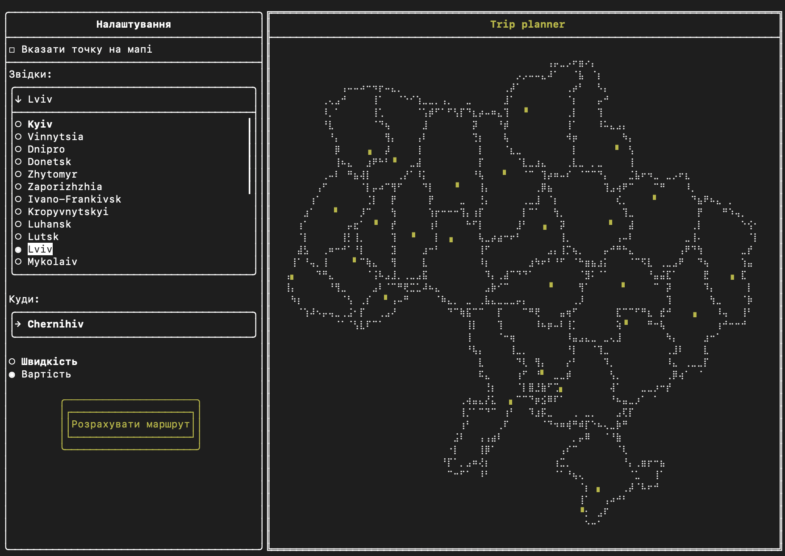
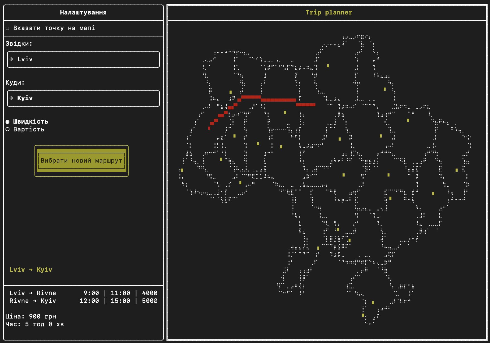
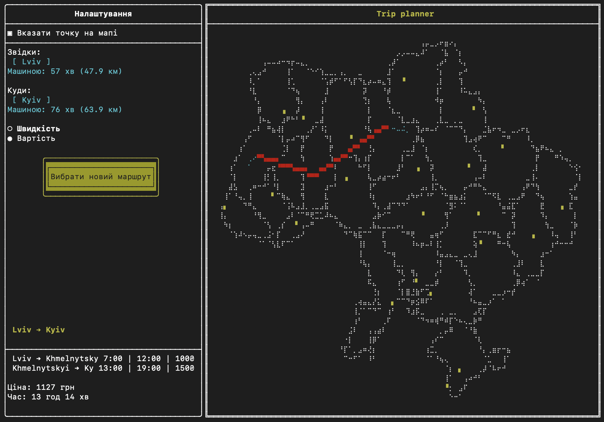
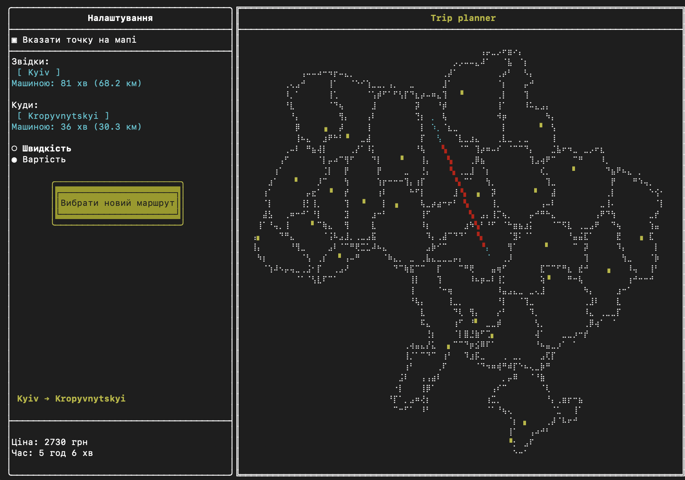

# Trip Planner

#### A C++ terminal-based system for optimizing and visualizing railway travel routes across Ukraine, utilizing Dijkstra's algorithm and a functional terminal user interface.

---

## Project Overview
This system calculates the most efficient or cost-effective paths between railway stations. It integrates graph theory with real-time visualization to map geographic data directly into the terminal environment.

## Key Features:
- **Dijkstra’s Algorithm Implementation:** Efficient pathfinding based on two primary weights: travel duration (time) and ticket pricing (cost).

- **Geographic Visualization:** High-fidelity rendering of Ukraine's national borders and station hubs using ftxui::Canvas.

- **Coordinate Projection Model:** Mathematical transformation of Longitude/Latitude coordinates into a discrete terminal-based coordinate system.

- **Interactive Spatial Interaction**: Mouse-event handling for selecting arbitrary points on the map.

---
## Interface Showcases
#### The main system view


#### Example of route calculation


#### "Custom Location" feature triggered by a mouse click


#### Multimodal Navigation: Integration of car travel and railway schedules to build a  trip across the map


#### Fallback to Car-Only Route
Demonstration of the system automatically switching to a car routing model when no train connectivity exists:


---
## 🛠 Technical Stack
- Language: C++17

- UI Framework: FTXUI

- Data Formats: GeoJSON, JSON (nlohmann/json), and structured TXT databases.

- Build System: CMake

📂 System Architecture

MapInterface: Encapsulates mathematical models for geographic projections and spatial distance algorithms.

main.cpp: Orchestrates the system lifecycle, including data initialization and UI rendering loops.

🚀 Installation & Build
# Prerequisites:
- CMake (3.10+)

- A C++ compiler supporting the C++17 standard (Clang or GCC).

# Build Instructions:
``` bash
mkdir build
```
``` bash
cd build
```
``` bash
cmake ..
```
``` bash
make
```
``` bash
./trip_planner
```
## Data Sources
The system operates on the following data structures:

- data/UA_FULL_Ukraine.geojson: Geographic boundaries of Ukraine.

- destination.txt: Database of railway stations with corresponding GPS coordinates.

- train.txt: Dataset containing route schedules, durations, and pricing information.
